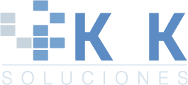

<div align="center">

# Zabavy project

### **✨ By Juanez ✨**


[](https://reflex.dev/docs/getting-started/introduction)

</div>

---

[English](https://github.com/reflex-dev/reflex/blob/main/README.md) | [简体中文](https://github.com/reflex-dev/reflex/blob/main/docs/zh/zh_cn/README.md) | [繁體中文](https://github.com/reflex-dev/reflex/blob/main/docs/zh/zh_tw/README.md) | [Türkçe](https://github.com/reflex-dev/reflex/blob/main/docs/tr/README.md) | [हिंदी](https://github.com/reflex-dev/reflex/blob/main/docs/in/README.md) | [Português (Brasil)](https://github.com/reflex-dev/reflex/blob/main/docs/pt/pt_br/README.md) | [Italiano](https://github.com/reflex-dev/reflex/blob/main/docs/it/README.md) | [Español](https://github.com/reflex-dev/reflex/blob/main/docs/es/README.md) | [한국어](https://github.com/reflex-dev/reflex/blob/main/docs/kr/README.md) | [日本語](https://github.com/reflex-dev/reflex/blob/main/docs/ja/README.md) | [Deutsch](https://github.com/reflex-dev/reflex/blob/main/docs/de/README.md)

---

# Zabavy

Zabavy es un conjunto de proyectos de utilidad escritos puramente en Python.

## { APP NAME }

Descripción.

### Características

- **Pure Python** - Write your app's frontend and backend all in Python, no need to learn Javascript.
- **Full Flexibility** - Reflex is easy to get started with, but can also scale to complex apps.

## ⚡ Permisos

Otorgue permisos de ejecución al archivo llamado `permission.sh` en la carpeta _bin_ y luego ejecútelo:

```bash
chmod +x ./bin/permission.sh && ./bin/permission.sh
```

## ⚙️ Instalación

Ejecute el archivo en _bin_ llamado `install.sh`:

```bash
./bin/install.sh
```

## 🫧 Test

Ejecute el archivo en _bin_ llamado `test.sh`:

```bash
./bin/test.sh
```

## 🫧 Ejecución

Ejecute el archivo en _bin_ llamado `run.sh`:

```bash
./bin/run.sh
```

## 🫧 Build

Ejecute el archivo en _bin_ llamado `build.sh`:

```bash
./bin/build.sh
```

## 📑 Recursos

<div align="center">

📝 [Docs](https://reflex.dev/docs/getting-started/introduction) &nbsp; | &nbsp; 🗞️ [Blog](https://reflex.dev/blog) &nbsp; | &nbsp; 📱 [Component Library](https://reflex.dev/docs/library) &nbsp; | &nbsp; 🖼️ [Gallery](https://reflex.dev/docs/gallery) &nbsp; | &nbsp; 🛸 [Deployment](https://reflex.dev/docs/hosting/deploy-quick-start) &nbsp;

</div>

## ✅ Estado

Zabavy es un proyecto que está en desarrollo continuo desde el 2020.

### Change log

For instance, you might use 🐛 for bug fixes, ✨ for new features, 📚 for documentation updates or ✅ for undefined.

- ## 2024/01/01 - V 0.0.1
  - ✅ Se agrega documento de identificación al repositorio plantilla.

## Acerca del desarrollador

<div align="center">


# Juan Esteban García Cardona.

</div>

✨ Ingeniero electrónico con amplia experiencia en desarrollo y diseño de hardware y software, con un enfoque especial en sistemas embebidos y algoritmos.

⚡ Mi versatilidad se basa en el dominio de diversos lenguajes de programación como Python, C, C++ y Javascript, así como en la creación de scripts y el desarrollo de APIs.
Además, poseo una sólida experiencia en el desarrollo frontend, utilizando HTML, CSS y JavaScript, y trabajando con frameworks como Vue.js y React.

💻 Mi pasión por la programación se refleja en mi capacidad para desarrollar soluciones integrales de software, incluyendo pequeños videojuegos, y mi habilidad para trabajar con tecnologías web, como API REST y SOAP. Apasionado por la innovación y la investigación, lo que me permite mantenerme actualizado en las últimas tendencias tecnológicas. Mi capacidad de aprendizaje y trabajo en equipo me permiten adaptarme fácilmente a nuevos entornos y colaborar eficientemente en proyectos complejos.

🌱 Actualmente estoy trabajando con [PiMedica S.A.](https://pimedica.com/).

💼 Con mis conocimientos he desarrollado en empresas como

<div align="center">

[](https://pimedica.com/) &nbsp; | &nbsp; [](https://k2ksoluciones.com/) &nbsp; | &nbsp; [](https://taclla.com/)

</div>

### Contacto

<div align="center">

💬 [Número telefónico]() &nbsp; | &nbsp; 📫 [Correo electrónico](mailto:juanezcere@gmail.com)

</div>

### Redes sociales

<div align="center">

📄 [Page](https://juanezcere.github.io/) &nbsp; | &nbsp; 📂 [GitHub](https://github.com/juanezcere) &nbsp; | &nbsp; 🔭 [LinkedIn](https://www.linkedin.com/in/juan-esteban-garcia-cardona-221222238/) &nbsp; | &nbsp; 👨‍💻 [Youtube](https://www.youtube.com/@MrJuanezzz)

</div>

## License

**Zabavy** es de código abierto y está licenciado bajo [Apache License 2.0](LICENSE).
